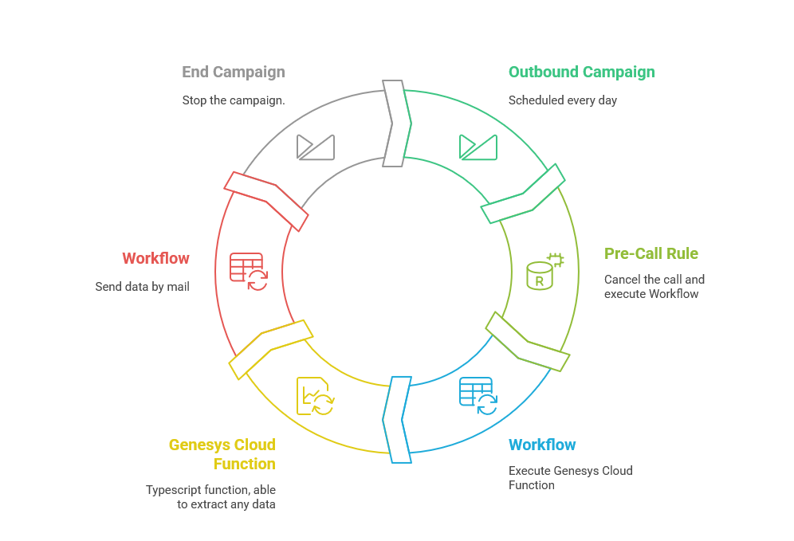

# Genesys Cloud Custom Exporter

This is a sample of how to create a custom scheduled export.
As native scheduled export from workspace views, this sample is only using Genesys Cloud resources.
Using [Genesys function](https://developer.genesys.cloud/blog/2025-01-14-genesys-functions/) allow us to customize which datas we will extract and how.
On this sample data actions errors, flow errors and interactions with small durations are exported.



## Terraform

Terraform folder include almost all Genesys Cloud objects needed to run the sample.

### OAuth

Terraform Oauth has to be to be created manually.  
Associated role need at least this permissions :  
`authorization:role:*`  
`oauth:client:*`  
`integration:integration:*`  
`architect:flow:*`  
`architect:job:*`  
`architect:ui:view`  
`authorization:division:*`  
`authorization:grant:*`  
`outbound:contactList:*`  
`outbound:contact:*`  
`outbound:campaign:*`  
`outbound:responseSet:*`
`scripter:script:view`  
`scripter:publishedScript:view`  
`integrations:action:*`  
`outbound:ruleSet:add`  
`routing:wrapupCode:add:*` 
`telephony:plugin:all`  

Oauth id ans secret need to be filled in a local.tfvars with the following structures :  
`oauthclient_id = ""`  
`oauthclient_secret = ""`  
`aws_region = "eu-west-1"`  
`function_name = "exporter_function"`  
`mails = "wrong@mail.com,wrong2@mail.com"`  
`mailsedge_group_name = "Genesys Cloud Hybrid Media Group"`  

`plan` and `apply` command need to be used with option `var-file=local.tfvars`  

### Process

1. Create terraform role and oauth
2. In terraform project, create local.tfvaes file and fill oaurh id and secret
3. Launch terraform apply, command will end with the following error : `API Error: 400 - The user does not have access to some of the specified roles.`
4. Assign the role `Custom Exporter Function Role` created by terraform to yourself and then to terraform oauth
5. Relaunch terraform apply
6. From the oauth `Exporter Integration Client` created by terraform, grab his id and secret. Add them into `exporter function integration` integration's credentials with the following keys : `gc_client_id` `gc_client_secret` and `gc_aws_region`
7. [Create function action](#function-action) (creation still not possible with terraform).
8. [Create campaign schedule](#campaign-schedule)

### Function action

<a name="function-action"></a>
For now, it's not possible too create function data action from Cx As Code.  
Create it manually by selecting integration `exporter function integration` et name it `exporter_function`.  

Fill contracts as following:  

```json
{
  "input": {
    "inputSchema": {
      "type": "object",
      "properties": {
        "interval": {
          "type": "string"
        }
      }
    },
    "output": {
      "successSchema": {
        "type": "object",
        "properties": {
          "shortConversations": {
            "type": "object",
            "properties": {
              "conversations": {
                "type": "array",
                "items": {
                  "type": "string"
                }
              },
              "total": {
                "type": "integer"
              }
            }
          },
          "flowErrors": {
            "type": "object",
            "properties": {
              "conversations": {
                "type": "array",
                "items": {
                  "type": "string"
                }
              },
              "total": {
                "type": "integer"
              }
            }
          },
          "dataActionErrors": {
            "type": "array",
            "items": {
              "type": "object",
              "properties": {
                "actionId": {
                  "type": "string"
                },
                "responseStatus": {
                  "type": "string"
                },
                "errorType": {
                  "type": "string"
                },
                "count": {
                  "type": "integer"
                }
              }
            }
          }
        }
      }
    }
  }
}
```

### Campaign Schedule

<a name="campaign-schedule"></a>
As Genesys function, outbound campaign can't be scheduled thanks to terraform. To do it manually, go to the schedule tab of campaign management.  
Select Resource Type: voice campaign, Voice Campaign: Exporter Campaign, then set start date and reccurence pattern as you want to.  
For example:  


#### Configuration
Headers :  
`gc_aws_region = $!{credentials.gc_aws_region}`  
`gc_client_id = $!{credentials.gc_client_id}`  
`gc_client_secret = $!{credentials.gc_client_secret}`  
   
#### Genesys Function
Handler : main.handler  
Runtime : nodejs22.x  
import [zip](./function/function_exporter.zip)


## Build Genesys Function

1. Create zip file  
   `npm run zipnodev`